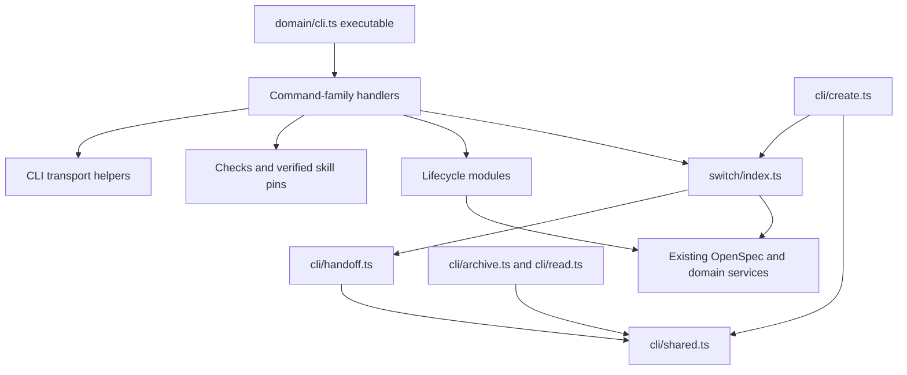

# CLI and lifecycle modularization

## Context

`src/domain/cli.ts` combines executable startup, parsing, rendering, seven command families, and diagnostic support. `src/cli/index.ts` combines lifecycle types, safety helpers, creation, reads, archive, and schema handoff. This change moves existing code; it does not repair a demonstrated runtime bug or introduce new behavior.

`package.json` exposes `src/domain/cli.ts` as the executable. CLI tests and `.github/scripts/release-guard.mjs` also depend on that path. `docs/commands.md` describes an executable, not a supported JavaScript import API; changing internal lifecycle import paths therefore requires migrating repository consumers, not publishing compatibility re-exports.

Approval and scope authority live in `journey.md` and `proposal.md`. Observable compatibility requirements live in `specs/project-and-agent-cli/spec.md` and the existing canonical specifications. This file owns implementation boundaries, sequencing, risks, and verification. `tasks.md` remains the sole implementation checklist once its separate approval gate is satisfied.

## Goals / Non-Goals

**Goals:** keep the executable small, give command families and lifecycle workflows focused ownership, remove the creation/switch/handoff import cycle, and prove the existing CLI and dashboard contract survives cutover.

**Non-goals:** parser redesign, new commands, aliases, frameworks, dependencies, generic handler registries, new retries or locks, resource-content changes, UI redesign, release work, or new lifecycle semantics. All schemas, skills, MCP providers, adapters, and dashboard capabilities remain.

## Selected Direction

- KTD1. **Direct extraction.** Move existing algorithms and branch ordering into ordinary modules rather than rewriting command handling. (session-settled: user-directed — chosen over keeping the current structure: user selected direct extraction after discussion of behavior-preservation risk.)
- KTD2. **Two responsibility groups.** Separate command-family handling from lifecycle workflows; keep the executable path unchanged. (session-settled: user-approved — chosen over adjusted boundaries: user approved command-family files and separate lifecycle flows with no behavior change.)
- KTD3. **One-way lifecycle dependencies.** `src/switch/index.ts` imports handoff preview and types directly from `src/cli/handoff.ts`. `src/cli/create.ts` may continue importing switch selection reads. Handoff and lifecycle shared helpers MUST NOT import switch or creation. This removes the current cycle without relocating switch transaction ownership.
- KTD4. **Minimal shared support.** CLI transport helpers contain only already-shared parsing, project resolution, token, status, and error behavior. Existing schema/MCP checks and verified skill-pin resolution get focused support modules so command handlers do not import each other. Single-consumer helpers stay with their workflow.
- KTD5. **Clean internal cutover.** Migrate every value and type consumer, then remove `src/cli/index.ts`; no barrel shim or re-export. Do not alter symbol names or signatures merely for style. Re-run language-server references immediately before implementation because researched callsites can change.

## Output Structure

Planned module paths; no second package or runtime framework:

```text
src/domain/cli.ts
src/domain/cli/shared.ts
src/domain/cli/checks.ts
src/domain/cli/skill-pins.ts
src/domain/cli/commands/reads.ts
src/domain/cli/commands/schemas.ts
src/domain/cli/commands/lifecycle.ts
src/domain/cli/commands/skills.ts
src/domain/cli/commands/mcp.ts
src/domain/cli/commands/adapters.ts
src/domain/cli/commands/diagnostics.ts
src/cli/shared.ts
src/cli/create.ts
src/cli/read.ts
src/cli/archive.ts
src/cli/handoff.ts
```

`src/domain/cli.ts` retains `main`, ordinary routing, one response renderer, exit mapping, help behavior, and TTY dashboard launch. It does not become an importable handler API. Command modules return existing data/results; they do not write response envelopes or start the dashboard. MCP's existing interactive approval prompt is the intentional stderr/TTY exception.

`src/domain/cli/shared.ts` owns `GlobalOptions`, `ParsedFlags`, `globalOptions`, `flags`, `one`, `many`, `requireCount`, `projectRoot`, `optionalProject`, `stable`, `applyToken`, `statusOf`, `validationPassed`, `errorMessage`, and the existing shared `skillBundle` choice validation. Keep `HELP` unchanged with the executable unless extraction requires it elsewhere.

`src/domain/cli/checks.ts` owns existing `validateBundledSchema`, `validateProjectSchema`, and `mcpCatalogCheck`. `src/domain/cli/skill-pins.ts` owns `samePinnedRevision`, `verifiedActiveSkillPins`, and `verifiedPinOptions`, consumed by skills and diagnostics. No support module imports a command handler or executable.

`src/cli/shared.ts` owns common action/result/confirmation types, internal plan types where shared, exact lifecycle token construction, failure envelopes, safe identifiers, project/path checks, fingerprints, metadata/CAS helpers, and revision/provenance helpers used by multiple workflows. Creation-, archive-, and handoff-specific inputs, previews, receipts, and helpers stay with those workflows. Preserve existing validation import behavior and staging cleanup; do not merge two token implementations.

## Dependency Shape



There is no dependency from handoff/shared back to switch, from support modules to command handlers, or from handlers to the executable. CLI and TUI keep using their existing domain services; no CLI transport dependency is added to the TUI.

## Implementation Guardrails

- Preserve global `--json`, `--help`, `-h`, and `--project` scanning at every currently accepted position. Preserve duplicate/unknown flag and argument-count behavior. Do not make the documentation's recommended option placement a new parser restriction.
- Preserve nearest-project resolution versus an explicit exact root. Resolve project-optional routes before requiring a project: bundled catalogs, validation/verify where already supported, and MCP catalog/preview routes with their existing schema/target requirements.
- Preserve help text, command labels, TOON and JSON facts, `schemaVersion: 1`, newline behavior, omission of unavailable fields, error codes, and nonzero exits. A thrown handler error must not acquire a new command label merely because routing was refactored.
- Keep lifecycle action/result versioning and `opsx-preview-v1` separate from CLI `opsx-apply-v1`. Preserve exact action, target, serialized binding, digest input, and freshness evidence. Do not add module paths or invocation-location-dependent data to tokens.
- Keep creation's selection-source checks, immutable revision retention, provenance finalization, and `CREATE_PARTIAL` behavior. Native-created changes remain present when finalization fails; no new destructive rollback.
- Keep archive's revision retention, strict validation, source-freshness and metadata/config guards, native archive delegation, and post-archive confirmation in their existing order. Native archive remains authoritative.
- Keep handoff's staged target validation, revision retention, guarded pin/provenance writes, rollback, no-op behavior, and `HANDOFF_PARTIAL` evidence. Do not rewrite artifact bodies or infer unknown historical origin.
- Preserve standalone associated-handoff refusal with `PROVENANCE_ASSOCIATION_REVIEW_REQUIRED`. Reviewed associated migrations remain owned by `src/switch/index.ts`, including its project lock, write journal, CAS, and recovery. Do not add that transaction model to standalone flows during extraction.
- Preserve path containment, symlink refusal, ownership, collision, external-edit detection, and recoverable-write semantics at their current boundaries. Resource declarations, subprocess results, and viewed files remain untrusted.
- MCP Apply still requires a usable TTY and immediate typed human approval of provider policy and exact host/path/diff. Tokens, JSON, catalog text, or agent assent never substitute for it. No new provider calls or installs are authorized by this plan.
- Preserve lazy/dynamic imports where they guard startup or cycles. New handler imports must not trigger argv processing, output, dashboard startup, filesystem writes, or provider activity.

## Capability Preservation Matrix

Existing operations are moved, never replaced. Listed tests are behavioral suites to reuse, not instructions to add mock-forwarding or source-text tests.

| Family / owner | Complete route coverage | Compatibility risks / proof |
| --- | --- | --- |
| Reads / `commands/reads.ts` | `status`, `changes [name] [file]`, `archive [name] [file]`, `resources [schema]` | Active/archive distinction, bounded file reads, selection/provenance visibility; `test/cli/commands.test.ts`, `test/domain/reads.test.ts`, `test/archive/safety.test.ts`. |
| Schemas / `commands/schemas.ts` | `schemas [name]`, `schemas bundled [name]`, `schemas install`, `schemas validate [name]` | All nine bundles, no-project reads, distinct-name installs, no implicit activation, stale/collision refusal; `test/cli/commands.test.ts`, `test/bundled/snapshot.test.ts`, `test/revisions/invariants.test.ts`. |
| Lifecycle / `commands/lifecycle.ts` | `change create`, `change status`, `change instructions`, `change validate`, `change archive`, `change schema`, `schema switch` | Exact targets, profile/host/bundle/migration flags, selection association, partial states and switch recovery; `test/cli/lifecycle.test.ts`, `test/cli/commands.test.ts`, `test/switch/transactions.test.ts`, `test/validation/validation.test.ts`. |
| Skills / `commands/skills.ts` | `skills inspect`, `skills doctor`, `skills reconcile`, `skills install`, `skills disable` | Named profiles distinct from five native hosts; shared targets deduplicated; verified pin association; no forced removal or history inference; `test/resources/resources.test.ts`, `test/cli/commands.test.ts`, `test/switch/transactions.test.ts`. |
| MCP / `commands/mcp.ts` | `mcp list`, `mcp inspect`, `mcp install` | Five hosts, bundled/installed resolution, target-dir requirements, Pi prerequisite, JSON cleanliness, preview without network/config writes, interactive approval; `test/mcp/safety.test.ts`, `test/cli/commands.test.ts`. |
| Adapters / `commands/adapters.ts` | `adapters inspect`, `adapters install` | Five host destinations, project scope, installed alias selection, verified compound bundle provenance, collision/stale refusal; `test/adapters/adapters.test.ts`, `test/cli/commands.test.ts`. |
| Diagnostics / `commands/diagnostics.ts` | `doctor`, `verify`; skills doctor remains with skills | Doctor: OpenSpec, skills, MCP with existing top-level fields. Project verify: doctor, schema, active changes, skills, MCP. Project-free verify: bundled schema/MCP checks. Keep order, names, skipped checks, catches, and distinct failure mapping; `test/cli/commands.test.ts`. |
| Dashboard / unchanged `src/tui/` | Overview, Changes, Archive, Settings | Same startup and focus/key flow; first three tabs read-only; Settings keeps schema/skill selections and separate MCP approval. `test/tui/shell-overview.test.tsx`, `test/tui/read-tabs.test.tsx`, `test/tui/settings-safety.test.tsx` plus actual TTY observation. |
| Package / unchanged bin contract | Packed consumer executable and resources | New module imports resolve from tarball without sibling checkout; same all-nine-schema catalog; `test/integration/distribution.test.ts` and package-consumer smoke. |

## Prioritized Implementation Units

All units cite KTD1 and KTD2. Dependency order is the priority; there are no optional feature tiers. These are design units, not a second progress tracker.

### U1. Separate lifecycle workflows and remove the cycle

**Dependencies:** none.

**Files:** create `src/cli/{shared,create,read,archive,handoff}.ts`; migrate `src/domain/cli.ts`, `src/switch/index.ts`, `test/cli/lifecycle.test.ts`, and `test/switch/transactions.test.ts`; remove `src/cli/index.ts` after references are clear.

**Approach:**
1. Assign shared guards and result types by actual consumers; keep workflow-specific helpers local.
2. Move creation, read actions, archive, and handoff unchanged. Preserve KTD3's dependency direction and KTD5's direct-import cutover, including `SchemaHandoffPreview` and the switch `ReturnType<typeof previewSchemaHandoff>` consumer.
3. Migrate existing value/type imports together; do not leave a barrel alias or mix old and new lifecycle implementations.

**Patterns:** existing lifecycle action envelopes, staging cleanup, metadata compare-and-swap, revision/provenance services, and native OpenSpec delegation.

**Verification scenarios:**
- Creation preview then Apply produces the same pin and provenance association for explicit, verified switch, and no-skills selection sources; absent/unverified required selection refuses.
- Creation finalization failure reports `CREATE_PARTIAL` and retains the native-created change.
- Status, instructions, and strict validation retain their existing result/error semantics.
- Archive refuses stale previews and incompatible state; successful archive keeps historical revision/provenance content.
- Handoff no-op, target incompatibility, stale metadata, guarded-write failure, and partial rollback retain existing results; associated standalone migration refuses.
- Schema switch still previews and applies reviewed associated migration, retains prior skills, and exercises its existing transaction recovery paths.

**Proof:** existing lifecycle/switch/validation/revision/archive suites, followed by actual CLI creation/archive/handoff in disposable OpenSpec projects. Assert filesystem state and errors, not merely returned forwarding values.

### U2. Extract transport support, reads, schemas, and diagnostics

**Dependencies:** U1 for a cycle-free lifecycle cutover.

**Files:** `src/domain/cli.ts`; new `src/domain/cli/{shared,checks,skill-pins}.ts`; new `commands/{reads,schemas,diagnostics}.ts`; `test/cli/commands.test.ts`, `test/domain/reads.test.ts`, `test/bundled/snapshot.test.ts`.

**Approach:**
1. Move existing support helpers per KTD4; keep `main`, envelope rendering, exit handling, help, TTY checks, and routing at the executable.
2. Move read branches, schema handlers, and both diagnostic orchestrators without merging doctor and verify.
3. Preserve project-optional dispatch, command-label timing, and helper consumers while remaining families still live in the executable.

**Verification scenarios:**
- Equivalent accepted global-flag positions preserve results; missing values, duplicate/unknown flags, extra positionals, and invalid exact roots retain existing failures.
- Nested-directory reads select nearest project; explicit roots select only that project; bundled catalogs and supported project-free diagnostics still work without a project.
- Missing active/archive records and unsafe file paths produce the same errors without writes.
- Schema install with a distinct available alias leaves default/pins unchanged; collision or source/destination drift refuses Apply.
- Doctor and verify preserve different check order, payload fields, skipped checks, and failure mapping for incomplete or invalid fixtures.
- JSON success, nested result failure, thrown error, help, and non-TTY bare invocation produce the existing stdout/exit contract.

**Proof:** existing command/read/bundle suites and actual text/JSON command subprocesses. Use temporary characterization scripts for incidental serialization comparisons; leave permanent tests only for uncovered consumer-visible boundaries.

### U3. Extract lifecycle command handlers

**Dependencies:** U1, U2.

**Files:** new `src/domain/cli/commands/lifecycle.ts`; `src/domain/cli.ts`; `test/cli/commands.test.ts`, `test/cli/lifecycle.test.ts`, `test/switch/transactions.test.ts`.

**Approach:** move `commandChange` and `commandSchema` with their existing flag definitions and calls. Import lifecycle operations directly from U1 modules. Use shared bundle validation rather than importing the skills handler. Keep CLI switch-token binding distinct from lifecycle confirmation.

**Verification scenarios:**
- Repeated profiles, native hosts, and migrations retain their current interpretation; invalid bundle/host and unsupported operations refuse.
- Create/archive/handoff previews bind the same action, root, change, and destination; correct Apply works, changed target/freshness refuses.
- Switch preview/apply retains selected migrations, exact selection, old effective pins, installed skills, and separate MCP boundary.

**Proof:** behavioral suites plus actual lifecycle and schema-switch CLI subprocess scenarios in disposable projects; verify receipts and unchanged artifact bodies.

### U4. Extract skill command handling

**Dependencies:** U2.

**Files:** new `src/domain/cli/commands/skills.ts`; `src/domain/cli.ts`; `test/resources/resources.test.ts`, `test/cli/commands.test.ts`, `test/switch/transactions.test.ts`.

**Approach:** move `commandSkills`, `skillDetails`, and `reconcileSkillPin`. Consume U2's verified pin support; keep resource installation/disable semantics in existing domain operations. No new skill alias or resource fetch behavior.

**Verification scenarios:**
- Inspect/doctor preserve profile/native-host/bundle distinctions and diagnostics.
- Reconcile exact revision/selection records a truthful association without inventing historical creation or installing resources; stale/conflicting input refuses.
- Install deduplicates shared targets and preserves preview/apply freshness; disable refuses shared, modified, unsafe, required, or unverified-pin resources.

**Proof:** existing resource/command/switch suites and controlled disposable-project CLI scenarios. External skill content remains untrusted; use existing local fixture conventions rather than depending on live downloads for deterministic checks.

### U5. Extract MCP command handling

**Dependencies:** U2.

**Files:** new `src/domain/cli/commands/mcp.ts`; `src/domain/cli.ts`; `test/mcp/safety.test.ts`, `test/cli/commands.test.ts`.

**Approach:** move `commandMcp`, `mcpSchemaDir`, `mcpHost`, and `promptMcpApproval` together. Preserve existing `createInterface` lifecycle, stderr prompt destination, typed approval callback, and TTY checks. No catalog/config changes or new provider connections.

**Verification scenarios:**
- Installed versus bundled schema and explicit target-dir resolution retain their existing behavior; unknown/unsafe catalogs and missing Pi integration refuse.
- Preview discloses the same policy and diff without network/config writes.
- Matching-token non-TTY Apply remains refused with no write; TTY refusal or cancellation leaves config unchanged and does not contaminate JSON stdout.
- Successful MCP writes remain covered by existing approved/simulated domain fixtures. Any live interactive install requires its own explicit target/provider approval; this plan does not authorize it.

**Proof:** existing MCP/command suites, actual preview and non-TTY refusal subprocesses, and an actual TTY cancellation path. Never automate affirmative human approval.

### U6. Extract adapter command handling

**Dependencies:** U2.

**Files:** new `src/domain/cli/commands/adapters.ts`; `src/domain/cli.ts`; `test/adapters/adapters.test.ts`, `test/cli/commands.test.ts`.

**Approach:** move `commandAdapters`, `adapterHost`, and `projectScope`. Preserve installed alias resolution, verified compound bundle source, exact token binding, and domain collision checks.

**Verification scenarios:**
- Each of five host/project destinations receives the same nine commands from a verified installed compound schema; arbitrary same-name sources refuse.
- Installed aliases remain valid when provenance matches; source drift, stale token, unsupported host/scope, and unowned collisions refuse without writes.

**Proof:** existing adapter/command suites and a disposable-project inspect/preview/apply scenario; assert installed command content and unchanged unrelated files.

### U7. Prove the complete cutover and update ownership documentation

**Dependencies:** U3, U4, U5, U6.

**Files:** `AGENTS.md`, `docs/commands.md` only where internal source guidance changes, `CHANGELOG.md`, existing `test/integration/distribution.test.ts` and TUI suites. `package.json` bin/files, release guard, bundled manifests/resources, and `src/tui/` should remain unchanged unless verification demonstrates an in-scope extraction requirement.

**Approach:** verify every matrix row, remove obsolete imports/comments and temporary comparison scripts, update ownership paths and changelog after smoke proof. No command-reference rewrite or version bump. One integration owner controls executable routing and direct-import cutover; independent handler extraction may use disjoint file ownership after U2.

**Verification scenarios:**
- Packed consumer resolves every new module and lists all nine schemas without a sibling checkout.
- Bare TTY entry opens the actual dashboard; Overview/Changes/Archive/Settings navigation, focus, file viewing, and Settings staging/cancel flow remain intact with no unintended write.
- Full-suite fixtures remain deterministic and isolated; no handler import triggers CLI startup.
- Existing command grammar and documented invocations still work in the source checkout and packed consumer.

**Proof:** targeted suites, actual CLI/TTY/package smoke, then one final aggregate quality gate. No runtime success is claimed from planning validation alone.

## Risks / Trade-offs

- More files add navigation overhead. Keep shared modules bounded by real consumers; do not add registries, factories, config, or one-implementation interfaces.
- Moving serialization or changing call order can invalidate fresh tokens. Preserve bytes/bindings and compare equivalent stable fixture inputs; avoid snapshotting timestamps or incidental wording into permanent tests.
- Extracting handoff through a shared barrel can recreate the switch cycle. Direct imports and KTD3's dependency boundary are mandatory; type-only consumers must migrate too.
- Eager imports can launch UI or change validation timing. Preserve current lazy imports and executable-only side effects; verify packed CLI startup.
- Treating doctor as an alias for verify changes failure behavior. Keep both orchestrators and their current ordered checks.
- A passing mocked handler test cannot prove filesystem recovery or packed imports. Reuse domain integration suites and actual subprocess/TTY/package observations.

## Migration Plan

Clean repository-internal cutover; no user-data or command migration. U1 migrates lifecycle consumers atomically. U2 creates transport/support boundaries. U3–U6 move families; one integration owner updates their shared executable routing. U7 validates and removes dead paths. Every landed unit must keep the executable operational; no temporary feature disable or compatibility shim.

Rollback of a code extraction uses normal review/revision, not a new runtime recovery mechanism. Existing mutation recovery semantics remain unchanged. No commit, push, merge, publication, or provider setup is authorized by this planning approval.

## Verification Contract

At implementation time, run applicable existing suites with `bun test <test-file>`. Complete `bun run test:distribution`, `bun run test:schemas` with OpenSpec available, and `bun run check` after integration. Record exact command exits, observed CLI/filesystem/TTY outcomes, and limitations in the change; component output alone is not a verified aggregate success.

Planning verification is `openspec validate modular-cli-lifecycle --type change --strict`, artifact readiness/path checks, and independent document review. Do not run builds or runtime tests to discover implementation behavior during planning.

## Open Questions

No unresolved product or architecture decision remains after recorded scope/route/direction approvals. Pre-task approval remains a workflow prerequisite, not implementation authority. Exact helper export membership and current references must be refreshed during implementation; a newly discovered behavior change or invalidated boundary requires a user-approved loopback, not silent redesign.

## Completion Criteria

Every operation in the preservation matrix remains available; existing safety/error/partial-state contracts are exercised; all internal lifecycle callers migrate; old barrel is removed; executable and packed consumer work; actual dashboard smoke succeeds; relevant suites and aggregate gate pass; ownership documentation/changelog reflect final code. Planning artifacts do not claim these implementation outcomes have already occurred.
